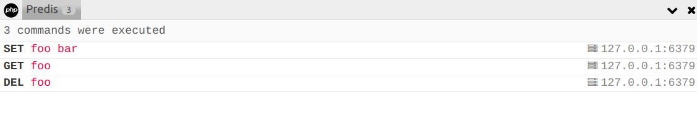

# Anper\PredisCollector

[![Software License][ico-license]](LICENSE.md)
[![Latest Version on Packagist][ico-version]][link-packagist]
[![Build Status][ico-travis]][link-travis]
[![Coverage Status][ico-coverage]][link-coverage]

[Predis](https://github.com/nrk/predis) collector for [PHP Debugbar](https://github.com/maximebf/php-debugbar).



## Install

``` bash
$ composer require anper/predis-collector
```

## Usage

``` php
use Anper\PredisCollector\PredisCollector;
use Predis\Client;

$client = new Client(...);

$collector = new PredisCollector();
$collector->addClient($client);

$debugbar->addCollector($collector);
```

## Test

``` bash
$ composer test
```

## Contributing

Please see [CONTRIBUTING](CONTRIBUTING.md) for details.

## Security

If you discover any security related issues, please email anper3.5@gmail.com instead of using the issue tracker.

## License

The MIT License (MIT). Please see [License File](LICENSE.md) for more information.

[ico-version]: https://img.shields.io/packagist/v/anper/predis-collector.svg?style=flat-square
[ico-license]: https://img.shields.io/badge/license-MIT-brightgreen.svg?style=flat-square
[ico-travis]: https://img.shields.io/travis/perevoshchikov/predis-collector/master.svg?style=flat-square
[ico-coverage]: https://img.shields.io/coveralls/github/perevoshchikov/predis-collector/master.svg?style=flat-square

[link-packagist]: https://packagist.org/packages/anper/predis-collector
[link-travis]: https://travis-ci.org/perevoshchikov/predis-collector
[link-coverage]: https://coveralls.io/github/perevoshchikov/predis-collector?branch=master
